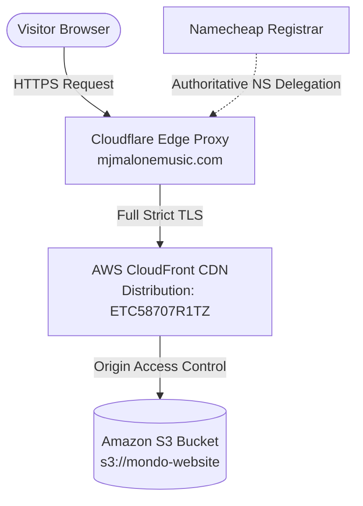

# Mondo Official Artist Website

Official web presence and digital press platform for hip-hop and rap artist Mondo. Engineered as a high-performance, zero-bloat vanilla static web application hosted on an enterprise AWS edge architecture.

---

## Architecture and Traffic Flow



1. **DNS & Nameservers:** Registered via Namecheap, authoritative nameservers delegated to Cloudflare for edge routing and CNAME flattening.
2. **CDN & Edge Caching:** AWS CloudFront terminates SSL via AWS Certificate Manager (ACM `us-east-1`) and caches assets globally across edge locations.
3. **Origin Storage:** Amazon S3 general-purpose bucket configured with all public access strictly blocked.
4. **Security & Access:** Origin Access Control (OAC) ensures files can only be fetched through CloudFront, preventing direct S3 bucket scraping.

---

## Tech Stack & Guardrails

- **Frontend:** Semantic HTML5, modern CSS3 (Custom Properties and mobile-first Grid/Flexbox), and vanilla modern JavaScript (ES6+).
- **Zero Node Runtime:** Completely free of Node.js, `npm`, `node_modules`, bundlers, or heavy external client frameworks.
- **Audio Engine:** Native HTML5 audio element connected to vanilla DOM controllers with progress scrubbing and state tracking.
- **Performance:** Pre-compressed WebP assets with explicit layout dimensions to ensure zero Cumulative Layout Shift (CLS) and sub-second load times.

---

## Directory Structure

```text
mondo-website/
├── .github/
│   └── workflows/
│       └── deploy.yml          # Automated CI/CD pipeline to S3 and CloudFront
├── assets/
│   ├── css/
│   │   └── style.css           # Autumn theme tokens and responsive layouts
│   ├── js/
│   │   └── script.js           # Vanilla menu toggle and audio player logic
│   ├── pics/                   # Web-optimized WebP and fallback JPG images
│   │   └── raw/                # Untracked master uncompressed camera originals
│   └── audio/                  # Audio tracks and preview snippets
├── .clineignore                # Context isolation rules for AI editor agents
├── .clinerules                 # Frontend standards and architecture guidelines
├── index.html                  # Core landing, bio, discography, and tour schedule
└── README.md                   # System architecture and documentation

```

---

## Local Development

Because the site uses native browser APIs and modular assets, testing requires only a lightweight HTTP server:

```bash
# Clone the repository
git clone [https://github.com/Moki00/mondo-website.git](https://github.com/Moki00/mondo-website.git)
cd mondo-website

# Launch local server using Python (no Node needed)
python -m http.server 8000

```

Navigate to `http://localhost:8000` in any modern web browser.

---

## Automated Deployment Pipeline

Deployments are fully automated via GitHub Actions on every push to the `main` branch:

1. **Trigger:** `git push origin main`
2. **Checkout:** Checks out the latest repository code.
3. **AWS Authentication:** Ingests `AWS_ACCESS_KEY_ID` and `AWS_SECRET_ACCESS_KEY` to authenticate against AWS `us-east-1`.
4. **S3 Sync:** Synchronizes production assets to `s3://mondo-website` with the `--delete` flag while excluding git artifacts, `.clinerules`, `.clineignore`, and `assets/pics/raw/*`.
5. **Edge Cache Invalidation:** Executes `aws cloudfront create-invalidation` on distribution ID `ETC58707R1TZ` for `/*` so updates reflect globally in real time.

---

## Live Endpoints

- **Production Domain:** [mjmalonemusic.com](https://mjmalonemusic.com)
- **Alternate Subdomain:** [www.mjmalonemusic.com](https://www.google.com/search?q=https://www.mjmalonemusic.com)
- **CloudFront Staging Endpoint:** [d164ew1y6g1loi.cloudfront.net](https://d164ew1y6g1loi.cloudfront.net)

---

### Next Step

1. Open `C:\_git\mondo-website\README.md` in VS Code and paste this content.
2. Commit and push the file:

   ```bash
   git add README.md
   git commit -m "docs: document system architecture, DNS routing, and CI/CD workflow"
   git push origin main
   ```

3. Your deployment workflow will automatically run, sync the updated repo, and keep the documentation version-controlled with the live infrastructure.
